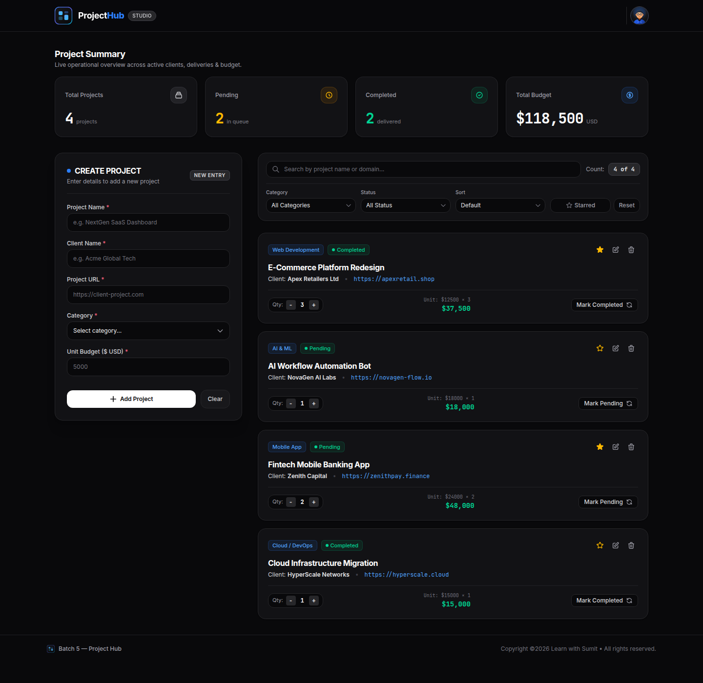
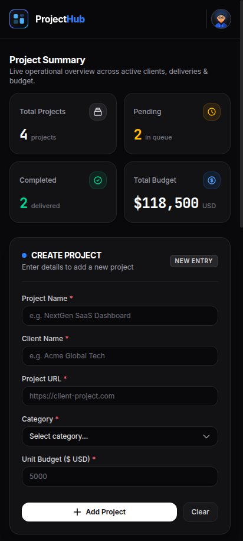

# 🚀 ProjectHub Studio — Modern Project Management Workspace

[](https://react.dev/)
[](https://tailwindcss.com/)
[](https://vitejs.dev/)
[](LICENSE)

A modern, high-performance, dark-themed Project Workspace and Management Dashboard built with **React 19** and **Tailwind CSS v4**. **ProjectHub** gives freelancers, agencies, and studio teams an operational overview to monitor client pipelines, calculate dynamic budgets, manage deliverables, and organize project records in real time.

---

## 📸 Screenshots & Preview

### 🖥️ Desktop Dashboard Overview


<details>
<summary>📱 <strong>Click to view Mobile Responsive View</strong></summary>

<br />

<div align="center">
  
</div>

</details>

---

## ✨ Features

### 📊 1. Live Operational Project Summary
* **Real-time Metrics**: Dynamic count cards that automatically update as projects are added, updated, status-toggled, or deleted.
  * **Total Projects**: Global project count.
  * **Pending Projects**: Queue of active deliverables in development.
  * **Completed Projects**: Delivered projects.
  * **Total Aggregate Budget**: Automatically computes `Unit Budget × Quantity` across all projects in USD.

### ➕ 2. Unified Project Creation & Edit Engine
* **Single Source of Truth**: Stateful form handling both **New Project Creation** and **Live Updating**.
* **Pre-population for Edits**: Clicking the edit action on any project card instantly loads project values into the form, changing the action button to **Update Project**.
* **Validated Form Fields**:
  * Project Name
  * Client Name
  * Live Project URL (with direct external links)
  * Category Selection
  * Unit Budget ($ USD)
* **Form Reset**: 1-click **Clear** button to quickly flush form inputs.

### 🔍 3. Real-Time Multi-Field Search
* Instant keyword search across multiple fields:
  * Project title
  * Client name
  * Project URL / domain
  * Category
* Displays live result counts (e.g. `Showing 4 of 4`).

### 🏷️ 4. Granular Filtering & Dynamic Sorting
* **Category Filter**: Filter instantly by `Web Development`, `Mobile App`, `UI/UX Design`, `Cloud / DevOps`, `AI & ML`, and `Branding & Growth`.
* **Status Filter**: View `All Status`, `Pending`, or `Completed`.
* **Dynamic Sorting**:
  * `Name: A-Z` and `Name: Z-A`
  * `Budget: Low-High` and `Budget: High-Low` (based on total calculated budget)
* **⭐ Starred / Favorites Filter**: Toggle between all projects and starred/bookmarked items with a single click.
* **Reset All**: Quickly clear search keywords, filters, and custom sorting back to default.

### 🧮 5. Interactive Project Cards
* **Quantity Stepper**: Increment (`+`) or decrement (`-`) project quantities on the fly with immediate budget re-calculations.
* **Cost Formula**: Live calculation display showing `Unit: $X × Qty = Total Budget`.
* **Status Toggle**: 1-click switch between `Pending` and `Completed` with animated status badges.
* **Favorite Toggle**: Mark/unmark projects as starred favorites.
* **Safe Deletion**: Remove unwanted projects directly from the workspace.

### 🎨 6. Sleek Dark Dashboard Architecture
* Designed with modern dark UI patterns using **Tailwind CSS v4**.
* Glassmorphism sticky header with branding and user avatar.
* Sticky desktop sidebar for the creation/edit form.
* Fully responsive layout adapting effortlessly from mobile phones to high-resolution desktop monitors.

---

## 🛠️ Tech Stack & Architecture

| Technology | Role |
| :--- | :--- |
| **[React 19](https://react.dev/)** | Component architecture, state hooks (`useState`), derived state & single source of truth |
| **[Tailwind CSS v4](https://tailwindcss.com/)** | Ultra-fast styling engine via `@tailwindcss/vite` |
| **[Vite](https://vitejs.dev/)** | Lightning-fast development server & optimized production bundler |
| **[ESLint 10](https://eslint.org/)** | Code quality, linting rules & React hooks validation |

---

## 🧱 Component Structure

```text
src/
├── assets/                          # SVG assets (Logo, Avatar, Empty State)
├── components/
│   ├── Header.jsx                   # Sticky glassmorphic top navigation bar
│   ├── ProjectSummary.jsx           # Top operational summary metrics cards
│   ├── MainColumnWorkspace.jsx      # Responsive 2-column workspace layout container
│   ├── ProjectForm.jsx              # Creation / update project form sidebar
│   │   ├── ProjectFormHeader.jsx    # Header section for the project form
│   │   └── ProjectFormInput.jsx     # Reusable text/number/url input field component
│   ├── ProjectControlAndCardsContainer.jsx # Wrapper for filters & project grid
│   ├── ProjectsControlAndFilter.jsx # Search, Category, Status, Sort & Starred controls
│   │   ├── ProjectSearch.jsx        # Search input with live item counter
│   │   ├── FilterInput.jsx          # Reusable select dropdown control
│   │   └── ToggleStarred.jsx        # Starred filter button & reset controls
│   ├── ProjectCardsGrid.jsx         # Card grid container with empty state handling
│   ├── ProjectCard.jsx              # Individual project card with live actions
│   ├── ProjectNotFound.jsx          # Empty state fallback
│   └── Footer.jsx                   # Studio footer
├── data/
│   └── project.js                   # Initial project records & mock datasets
├── App.jsx                          # Root component: master state, derived filtering & sorting
├── main.jsx                         # React DOM mount point
└── index.css                        # Tailwind CSS v4 directives & root styles
```

---

## 🚦 Getting Started

Follow these instructions to run the project locally on your machine.

### Prerequisites

* **Node.js**: `v18.0.0` or higher
* **npm**: `v9.0.0` or higher (or `pnpm` / `yarn`)

### 1. Clone the Repository

```bash
git clone git@github.com:MahiAlamAzads/rnext-5-assignment-2.git
cd rnext-5-assignment-2
```

### 2. Install Dependencies

```bash
npm install
```

### 3. Run Development Server

```bash
npm run dev
```

Open your browser and navigate to `http://localhost:5173`.

### 4. Build for Production

```bash
npm run build
```

The production-ready assets will be compiled into the `dist/` directory.

### 5. Preview Production Build

```bash
npm run preview
```

### 6. Code Quality / Linting

```bash
npm run lint
```

---

## 💡 State Management Workflow

* **Master State (`projects`)**: Located at the top-level `App.jsx`, ensuring immutability when applying filters or searching.
* **Derived State (`visibleProjects`)**: Computed in real-time by chaining:
  1. `matchesSearch(project)` — verifies name, client, URL, and category matches.
  2. `matchesFilters(project)` — verifies category selection, status match, and favorite status.
  3. `sortProjects(list)` — applies alphabetical or budget ascending/descending sorts.
* **Two-way Form Binding (`data`)**: Lifted to `App.jsx` to enable both card editing and new project creation seamlessly without state conflicts.

---

## 👤 Author

* **Mahi Alam Azad**
  * GitHub: [@MahiAlamAzads](https://github.com/MahiAlamAzads)
  * Course: **Learn with Sumit — Reactive Accelerator (Batch 5 - Assignment 2)**

---

## 📄 License

This project is licensed under the [MIT License](LICENSE).
